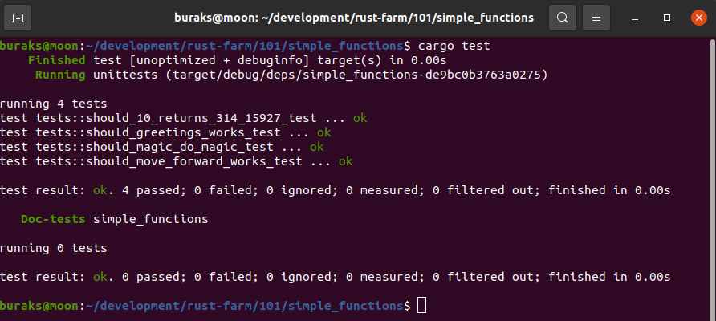
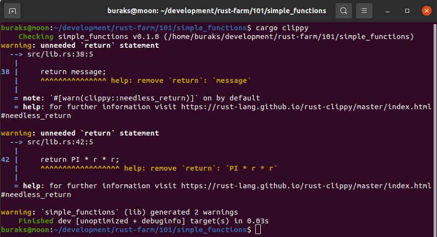
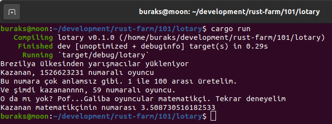
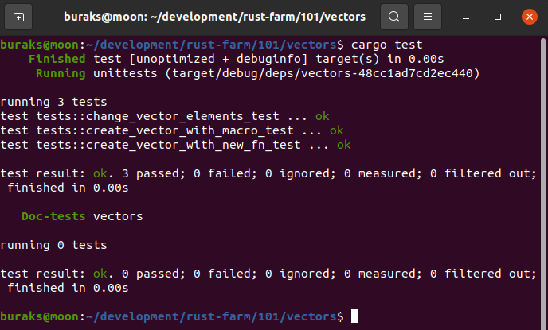
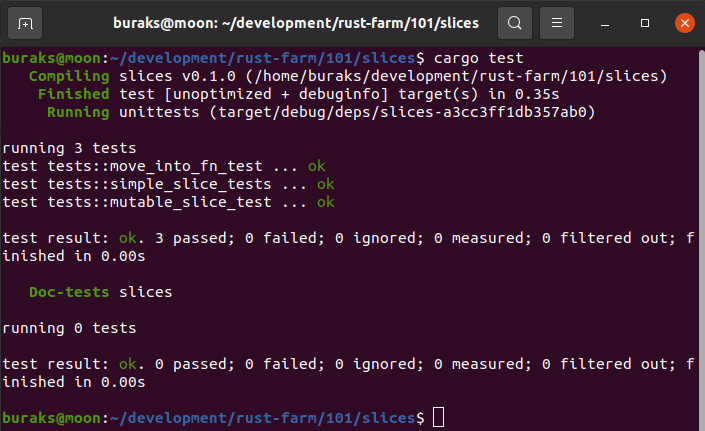
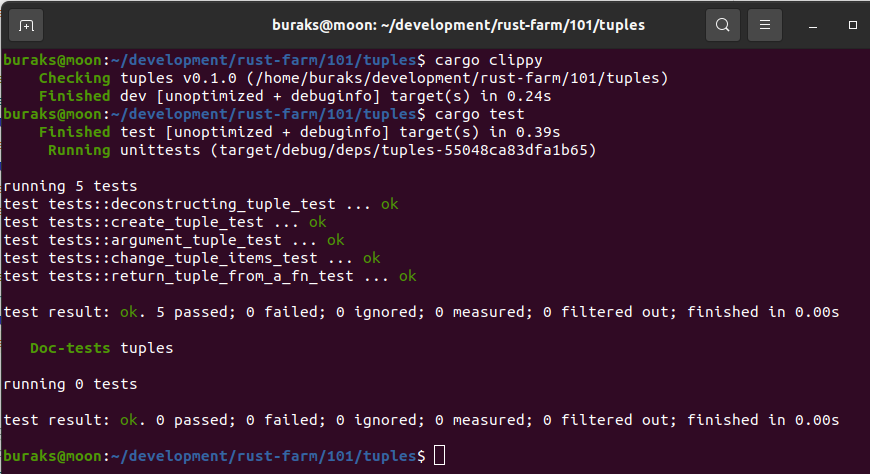
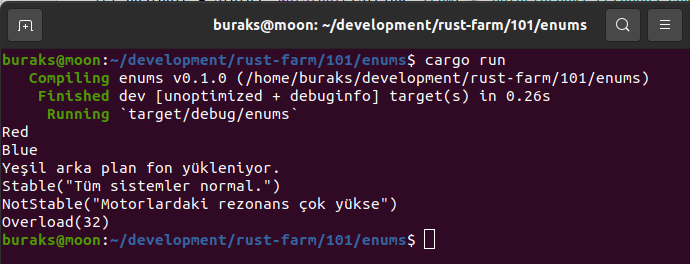
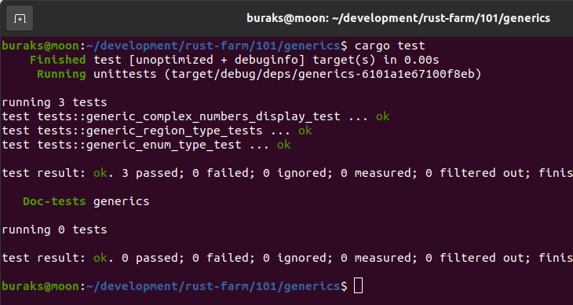

# Rust Programlama Dili Temelleri _(Başlangıç Seviyesi)_

Rust dilinin temellerini ve sahip olduğu genel enstrümanların nasıl kullanıldığını öğrenmek amacıyla oluşturulmuş bir dokümandır.

## Örnekler

Gerekli açıklamalar kod satırları arasında yer almaktadır.

### Module00: Hello World

```shell
# hello_world isimli yeni bir proje oluşturulur.
cargo new hello_world

# çalıştırmak için
cargo run
```


### Module01: newton _(Test yazmak, Doküman Oluşturmak)_

```shell
# Yeni fonksiyonlar taşıyan kütüphaneler oluştururken 
cargo new newton --lib

# Test koşturmak için
cargo test

# Yardım dokümanını oluşturmak için
cargo doc

# sonrasında doc/newton/index.html'e bakılabilir
```


/// ifadeleri ile oluşturulan yardımcı bilgiler html dosyası üzerinden görüntülenebilir. Tüm Rust çevresindeki standart doküman formatı budur ve markdown tabanlıdır.


Yardım dokümanları fonksiyon gibi öğelerin kullanımında geliştiriciye önemli ipuçları verir.


### Module02: scalar_types _(Temel Veri Türleri)_

__Scalar Data Types__

    Integer:

    Size    Signed      Unsigned

    8 bit   i8          u8
    16 bit  i16         u16
    32 bit  i32         u32 (tamsayılar için varsayılan türdür)
    64 bit  i64         u64
    128 bit i128        u128
    arch    isize       usize (mikro işlemci mimarisine göre)

    Float:

    32 bit  f32
    64 bit  f64 (noktalı sayılar için varsayılan türdür)

    Boolean:

    true
    false

    Char:

```shell
# Projeyi oluşturmak için
cargo new scalar_types

# Programı çalıştırmak için
cargo run
```

Çalışma zamanından basit bir görüntü.


### Module03: Basit Fonksiyonlar _(some_functions)_

Temel fonksiyon kullanımlarına bir bakalım.

```shell
# Kütüphane olarak oluşturalım.
cargo new simple_functions --lib

# test etmek için
cargo test
```

Çalışma zamanına ait örnek görüntü.



Hemen araya reklam olarak faydalı iki _cargo_ komutu alalım.

```shell
# Kod içeriğini RustFmt'te göre formatlar.
# Yani terminalden de format düzenlemeleri yaptırabiliriz.
cargo fmt

# Bu ise kodun idiomatic olmasını sağlar.
# Yani kodun Rust'ın getirdiği özellikler kullanılarak daha düzgün yazılması için önerilerde bulunur.
cargo clippy
```

Yukarıdaki örnekte yer alan iki fonksiyonu aşağıdaki hale getirelim.

```rust
pub fn greetings(your_name: &str) -> String {
    let message = format!("Merhaba {}.", your_name);
    return message;
}

pub fn square_of_circle(r: f32) -> f32 {
    return PI * r * r;
}
```

Önceki kullanımdan farklı olarak bilinçli bir şekilde return kullandık. Normalde geriye sonuç döndüren fonksiyonlarda son satırda return veya ; kullanımına gerek yoktur. Tail Expression şeklinde ilerlenebilir. _cargo clippy_ komutunu örnek için çalışıtırırsak aşağıdaki uyarıları verir.



Yani clippy der ki, "kodunu taradım ve aslında daha idiomatic önerilerim var..." Clippy kodu otomatik olarak derler ve belirli problemlerin olup olmadığını tarar. Sonra da sonuçları programcıya tatlı dille aktarır :)

_Clippy pek çok kategoride düzeltmeler sunar. Performas, yazım stili, kod karmaşıklığı, kısıtlar vs...[Detaylar için clippy lint adresine uğramakta yarar var](https://rust-lang.github.io/rust-clippy/master/)_

### Module04: Modül Oluşturma ve Kullanma _(music_shop)_ 

Aynı konu altında birleşen fonksiyonellikleri modül veya sandıklarda _(crate)_ toplarız.

```shell
cargo new soundlib --lib
cd soundlib/src/

# dosya olarak module
touch musicbox.rs
```

### Module05: Crate _(Sandık)_ Kullanımı

Modülleri benzer amaçlar doğrultusunda bir arada toplamanın yolu onları bir sandık _(crate)_ içerisine koymaktır.

```shell
# Örneği aşağıdaki gibi oluşturabiliriz.
cargo new lotary

cd lotary/src/
touch warehouse.rs

# Çalıştırmak için
cargo run
```

Örnekte rastgele sayı üreteci olarak [rand](https://crates.io/crates/rand) isimli crate kullanılmakta. crates.io, rust ile ilgili paketlerin yayınlandığı ortamdır. Buna benzer harici crate bildirimleri toml dosyasında yapılır.

Örnek ilk çalıştırıldığında toml içinde belirtilen harici crate'ler yüklenir.


Çalışma zamanına ait bir görüntü.



### Module06: Arrays

Sık kullanılan veri tiplerinden birisi dizilerdir. Diziler sabit boyutludur. Elemanlar aynı tipten oluşur. Dizi elemanlarında değişiklik yapmak için nesnenin mutable tanımlanması gerekir.

```shell
# Örneği kütüphane olarak oluşturalım
cargo new arrays --lib

# Testleri aşağıdaki gibi koşturalım
cargo test
```


### Module07: Vectors

Rust standart kütüphanesinde yer alan Vec yapısı _(struct)_ ile boyutu değiştirilebilir veri serilerini kullanabiliriz. Vec gibi built-in türlerde rust kütüphanesine geçip ne olduklarına ve nasıl kullanıldıklarına bakmakta yarar var. 
Örneğin Vec tipi için [şuradaki yardım dokümanına](https://doc.rust-lang.org/std/vec/struct.Vec.html#) bakmak ve hatta [src](https://doc.rust-lang.org/src/alloc/vec/mod.rs.html#400-403) linkinden yararlanıp nasıl yazıldığını görmekte yarar var. Kullandığımız tüm built-in enstrümanlar için bu şekilde ilerleyerek Rust dilini daha iyi öğrenebiliriz.

```shell
cargo new vectors --lib

cargo test
```



### Module08: Slice

Bir veri serisinin bellekteki belli bir bloğunu temsil eden işaretçi olarak düşünülebilir. Read-Only'dir ve sabit boyutludur. Boyutu sabit olmasına rağmen çalışma zamanında belirlenebilir. Yaygın olarak Array, Vector ve String türleri ile kullanılır.

```shell
cargo new slices --lib

cargo test
```



### Module09: Tuples

Tuple farklı türden verileri bir arada tutabilen bir veri türüdür. Statik özelliği taşırlar ve yeniden boyutlandırılamazlar. Dolayısıyla bellek kapsama alanları en baştan bellidir. Elemanları değiştirilebilir, metotlara parametre olarak aktarılabilir veya dönüş tipi şeklinde kullanılabilir.

```shell
cargo new tuples --lib
# Alışkanlık kazanalım yazdıklarımızın idiomatic olup olmadığını görelim.
# Uyarılara kulak verelim ve değiştirelim.
cargo clippy
cargo test
```



### Module10: Struct Data Type

Kendi veri tiplerimizi struct olarak tanımlarız.

```shell
cargo new structs --lib
cargo clippy
cargo test
```


### Module11: Enum Veri Türü

Kullanıcı tanımlı veri türlerinden birisidir. Diğer dillerde genellikle sayılara anlamlı isimler vermek için kullanılır. Rust tarafında enum değerleri türlendirilebilir.

```shell
cargo new enums
cargo clippy
cargo run
```



### Module12: Generics

Kendi veri modellerimizi tasarlarken de generic türlendirmelerden yararlanabiliriz.

```shell
cargo new generics --lib
cargo clippy
cargo test
```



### Module13: if, match, pattern matching

Pek tabii bu konulara değinmeden olmaz.

```shell
# if,else örneği
cargo new conditions
cargo clippy
cargo run

# match statement örneği
cargo new matching
cargo clippy
cargo run
```

İlk örnekte basit bir sayı tahmin oyunu söz konusu.


İkinci örnekte çeşitli pattern matching kullanımları var.


### Module14: Loops

__todo!();__

### Module14.5: Scope Hakkında Minik Bilgi

__todo!();__

### Module15: Closures

__todo!();__

### Module16: Higher Order Functions

__todo!();__

### Module17: Macros

__todo!();__

### Module18: Traits

__todo!();__

### Module19: Generic Traits

__todo!();__

### Module20: Fonksiyonlardan Trait Döndürmek için Box Kullanmak

__todo!();__

### Module21: Built-In Türlere Kendi Trait'lerimizi Eklemek

__todo!();__

### Module22: Operator Overloading

__todo!();__

### Module23: Trait'lerde Static Dispatch

__todo!();__

### Module24: Ownership Kuramı

__todo!();__

### Module25: Borrowing

__todo!();__

### Module26: Lifetimes

__todo!();__

### Module27: Otomatik Atanan Lifetime Meselesi

__todo!();__

### Module28: Reference Counted Variables

__todo!();__

### Module29: Dosyalarla Çalışmak

__todo!();__

### Module30: Hata Yönetimi (panic, Result<T,Error>, Option<T>)

__todo!();__

### Module31: unwrap, expect ve ? operatörü

__todo!();__

### Module32: Threads

__todo!();__

### Module33: Channels

__todo!();__

### Module34: Concurrency'de Mutex Kullanımı

__todo!();__