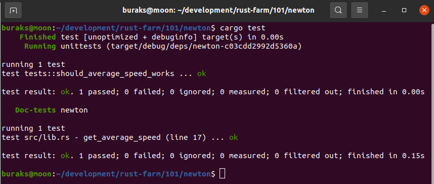

# Rust Programlama Dili Temelleri _(Başlangıç Seviyesi)_

Rust dilinin temellerini ve sahip olduğu genel enstrümanların nasıl kullanıldığını öğrenmek amacıyla oluşturulmuş bir dokümandır.

## Örnekler

Gerekli açıklamalar kod satırları arasında yer almaktadır.

### Module00: Hello World

```bash
# hello_world isimli yeni bir proje oluşturulur.
cargo new hello_world

# çalıştırmak için
cargo run
```


### Module01: newton _(Test yazmak, Doküman Oluşturmak)_

```bash
# Yeni fonksiyonlar taşıyan kütüphaneler oluştururken 
cargo new newton --lib

# Test koşturmak için
cargo test

# Yardım dokümanını oluşturmak için
cargo doc

# sonrasında doc/newton/index.html'e bakılabilir
```



/// ifadeleri ile oluşturulan yardımcı bilgiler html dosyası üzerinden görüntülenebilir. Tüm Rust çevresindeki standart doküman formatı budur ve markdown tabanlıdır.


Yardım dokümanları fonksiyon gibi öğelerin kullanımında geliştiriciye önemli ipuçları verir.


### Module02: scalar_types _(Temel Veri Türleri)_

__Scalar Data Types__

    Integer:

    Size    Signed      Unsigned

    8 bit   i8          u8
    16 bit  i16         u16
    32 bit  i32         u32 (tamsayılar için varsayılan türdür)
    64 bit  i64         u64
    128 bit i128        u128
    arch    isize       usize (mikro işlemci mimarisine göre)

    Float:

    32 bit  f32
    64 bit  f64 (noktalı sayılar için varsayılan türdür)

    Boolean:

    true
    false

    Char:

```bash
# Projeyi oluşturmak için
cargo new scalar_types

# Programı çalıştırmak için
cargo run
```
