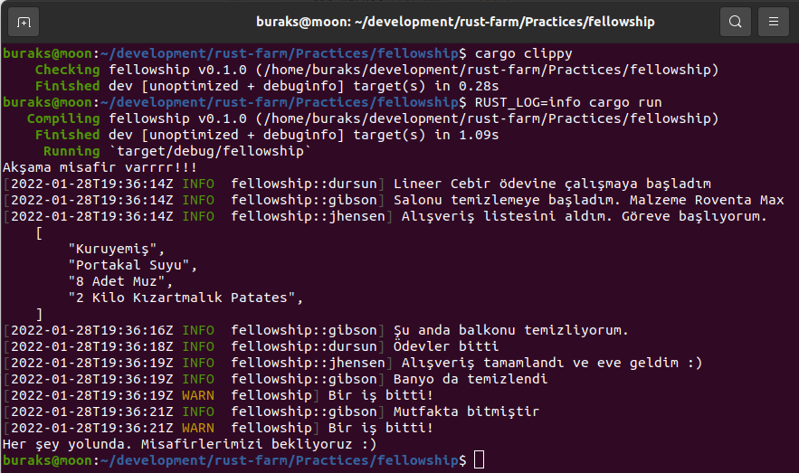

# Multi-Threading'i Dedene Nasıl Anlatırsın? :P

Rust dilinde thread'ler nasıl oluşturulur ve işlerler, en basit haliyle görmek için yazılmış bir koddur. Senaryoda aynı öğrenci evinde kalan üç kafadar vardır. O güzel güneşli Cumartesi gününün akşamında milli maçı izlemek için misafirler gelecektir. Zaman azdır. Karadenizli Dursun'ın Pazartesi Lineer Cebir sınavı vardır ama Danimarkalı Yensen ile Yeni Zellandalı Gibsın'ın zamanları vardır. Dursun ders çalışırken Gibsın kendisine verilen listedekileri almak üzere alışverişe çıkacak ve Yensen'de evi toparlayıp temizleyecektir. 

Esasında Yensen, Gibsın ve Dursun belli bir müddet birbirlerinden bağımsız şekilde hareket edip aksiyon alabilirler. Dursun dersini çalışmaya devam ederken, Gibsın alışverişi yapabilir ve Yensen'de evi süpürebilir. İşte size 3 tane thread. Şimdi sıra bu işleyişi programlamakta.

```shell
cargo new fellowship
cd fellowship
touch src/jhensen.rs
touch src/gibson.rs
touch src/dursun.rs

cargo clippy
# log paketini kullandığımız için
RUST_LOG=info cargo run
```

Bir uygulama işletim sisteminde genelde bir Process olarak ayağa kalkar. Bir process içerisinde işleri birbirlerinden bağımsız olarak yapan thread'ler söz konusu olabilir. Process içerisinde thread açmak kolaydı ve maliyeti düşüktür. Üstelik aynı Process içerisindeki bu thread'ler birbirleriyle kolayca haberleşebilirler.

Lakin çok uzun zamandır birden fazla çekirdek içeren CPU'lar söz konusudur. Bu CPU'lardaki her bir çekirdek _(core)_ belli bir anda bir thread'i işletebilir. Dolayısıyla programlarımızdaki thread'leri bu CPU çekirdeklerine verip eş zamanlı olarak bir takım işlerin çalıştırılmasını sağlayabiliriz ki bu Parallel Processing olarak bilinir.

Uygulamanın çalışma zamanı çıktısı aşağıdaki gibidir.

