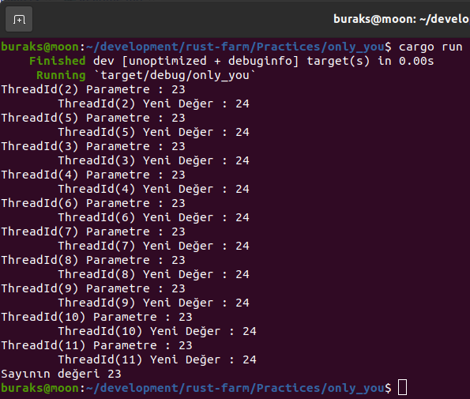

# Aynı Anda Sadece Tek Bir Değiştirilebilir Referans Olabilir

Thread'ler ve eş zamanlı iş parçacıkları işin içerisine girdiğinde karşımıza çıkan önemli konulardan biriside mutable türden referansları nasıl kullanacağımızdır. Malum bu thread'ler aynı veri üzerinde değişiklik yapmak isteyebilirler. Data Races oluşmaması Rust'ın temel ilkelerinden birisidir ve bunun en büyük sebebi bellek ortamını güvenli halde koruyabilmektir. Dolayısıyla belleğin referans edilen bölgelerinin bu thread'ler içerisinde yazma amaçlı ele alınması durumlarında kod biraz karmaşıklaşabilir. Öncesinde kuralın ne olduğunu dile getirelim; ___Rust bir t anında birden fazla mutable referans oluşturulmasına izin vermez, buna müsaade edecek şekilde kodlama yapmamızı engeller.___ Elbette konuyu anlamanın en güzel yolu basit bir örnek üzerinden ilerlemekle mümkün. Öyleyse başlayalım.

```shell
# Projemizi aşağıdaki gibi oluşturabiliriz.
cargo new only_you
cd only_you

# Kodun kalitesine bakmak için
cargo clippy

# ve çalıştırmak için 
cargo run
```

İlk başta kodlarımız aşağıdaki gibi.

```rust
use std::thread;

fn main() {
    // Birkaç thread'in ortaklaşa kullanmak istediği bir sayı belirleyelim.
    let mut popular_number = 23_u32;

    // JoinHandle nesneleri için bir vector. Main'i bekletmek için kullanırız.
    let mut handlers = Vec::new();

    // 10 tane thread açalım
    for _ in 0..10 {
        handlers.push(thread::spawn(|| {
            // Her bir thread popüler olan sayımızı 1 birim artırsın
            popular_number += 1;
        }));
    }

    for h in handlers {
        let _ = h.join();
    }
}
```

Birden fazla thread'in ortaklaşa artıracağı bir sayımız var. 10 thread açıp değerini 1 birim artırmak istiyoruz. Ne yazık ki uygulamamızı bu haliyle çalıştırmak istediğimizde aşağıdaki hatalar ile karşılaşacağız.


Hata mesajı açık bir şekilde popular_number'ın birden çok kez mutate edilmeye çalışıldığını belirtmekte. Esasında bunu çözmenin basit bir yolu var. Spawn fonksiyonunda move özelliğini kullanarak her bir thread'in popular_number'ın birer kopyasını almasını sağlayabiliriz. Kopyasını almak istediğimiz sonucu vermeyebilir ki bunu şimdi göreceğiz. main içeriğini aşağıdaki gibi değiştirerek devam edelim.

```rust
use std::thread;

fn main() {
    // Birkaç thread'in ortaklaşa kullanmak istediği bir sayı belirleyelim.
    let mut popular_number = 23_u32;

    // JoinHandle nesneleri için bir vector. Main'i bekletmek için kullanırız.
    let mut handlers = Vec::new();

    // 10 tane thread açalım
    for _ in 0..10 {
        handlers.push(thread::spawn(move || {

            println!(
                "{:?} Parametre : {}",
                thread::current().id(),
                popular_number
            );

            // Her bir thread popüler olan sayımızı 1 birim artırsın
            popular_number += 1;

            println!(
                "\t{:?} Yeni Değer : {}",
                thread::current().id(),
                popular_number
            );
        }));
    }

    for h in handlers {
        let _ = h.join();
    }

    println!("Sayının değeri {}", popular_number);
}
```

Hata mesajından kurtulduğumuzu söyleyebiliriz ancak program pekte istediğimiz gibi çalışmayacaktır. Normalde her thread'in bu ortak sayı değerini birer artırmasını bekliyoruz. Lakin thread'lere ilgili değişkeni move sebebiyle kopyalayarak verdiğimizden her thread kendi 23 değerini kullanıyor. Sonuçta aşağıdaki gibi bir çıktı elde edeceğiz.



Şimdi ne yapacağız? Ortak veriyi bir Mutex nesnesi olarak ele almak esasında işimizi çözecektir. Lakin Mutex kullandığımızda değeri okuyabilir ve eğer onun için bir kilit açmışsak üzerine yazma işlemi gerçekleştirebiliriz. Gelin kodumuzu aşağıdaki halde yeniden tasarlayalım.

```rust

```