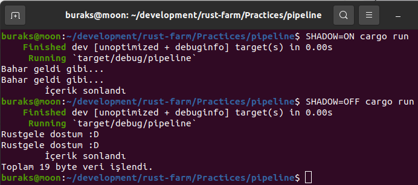
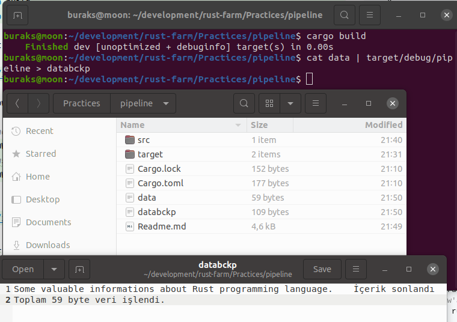

# Program Girdilerini Okumak ve Yazmak

Sistem programları genellikle komut satırından çalıştırılan ve çeşitli girdilere göre bazı süreçleri işletip çıktı veren uygulamalar olarak düşünülebilir. Terminalden ya da bir başka deyişle komut satırından çalışan bir uygulama için girdiler düşünüldüğünde kullanıcının yazdıkları da bunlar arasında yer alır. Yani kabaca kullanıcıdan terminale birşeyler girmesini istediğimiz hallerden bahsediyorum. Bu tip uygulamalarda Rust'un built-in modüllerinden olan io altındaki çeşitli fonksiyonellikler kullanılır. stdin ve stdout fonksiyonlarından yararlanarak girdi alıp çıktı üretmek mümkün ve basittir. 

Bu fonksiyonelliklerin kullanımlarına bakarken incelediğim bir örnek bana bir sürü yeni şey öğretti. Mesela uygulamaya kullanıcı girdisi haricinde echo komutu ile bilgi aktarabileceğimi ve hatta cat ile bir dosya içeriği verip kopyasını çıktı olarak verebileceğimi öğrendim. Nasıl olduğuna bamak için örnek uygulama üstünden ilerleyelim. Örneği Ubuntu platformunda geliştirdiğim için echo ve cat gibi terminal araçlarını kullanabileceğim.

```shell
cargo new pipeline
```

Program kodumuzu aşağıdaki gibi yazabiliriz.

```rust
use std::io::{Read, Write};
use std::{env, io};

/*
   Program, terminal girdilerini 512 byte'lık bloklar haline okuyacak.
   Onu bir sabit olarak tanımlayabiliriz.
*/
const BLOCK_SIZE: usize = 512;

fn main() {
    // environment'ten bir parametre alıp nasıl kullandığımıza bakalım.
    let shadow_mode = env::var("SHADOW").unwrap_or_default() == "ON";
    // Toplamda kaç byte işlediğimizi görmek istiyoruz
    let mut total_bytes = 0;
    // Örnek sonsuz bir döngü içinde çalışıyor.
    // Yani kullanıcı kapatana kadar girdi alabilir.
    loop {
        // Gelen girdiyi hep 512 byte'lık bloklar halinde okumaktayız
        let mut buffer = [0; BLOCK_SIZE];
        // read çağrısı ile okunan içeriği buffer'a yazmaktayız.
        // Eğer okunacak bir içerik yoksa veya hata varsa döngüyü kırıyoruz.
        // Aksi durumda okunan içeriğin uzunluğunu yakalıyoruz.
        let bytes_read = match io::stdin().read(&mut buffer) {
            Ok(0) => {
                println!("\tİçerik sonlandı");
                break;
            }
            Ok(length) => length,
            Err(e) => {
                println!("Bir hata oluştu.{}", e);
                break;
            }
        };
        // Bir önceki adımda ne kadar byte okuduysak ekliyoruz
        total_bytes += bytes_read;
        // Okunan içeriği yazdığımız buffer'ı okunan byte kadar çıktıya iletiyoruz.
        // Bu çıktı duruma göre terminal ekranı, bir dosya veya ağ paketi de olabilir
        match io::stdout().write_all(&buffer[..bytes_read]) {
            Ok(_) => {}
            Err(e) => println!("Yazma işlemi sırasında hata. {}", e),
        };
    }

    // Environment değişkeninin nasıl kullandığımıza bakın.
    // Eğer SHADOW=ON şeklinde bir şey gelmişse total_bytes ekrana basılmayacak.
    if !shadow_mode {
        println!("Toplam {} byte veri işlendi.", total_bytes);
    }
}
```

Program stdin fonksiyonu ile gelen girdiyi okumakta ve esasında stdout ile çıktı vermekte. stdout, kullanıma göre farklı yerlere bilgi yazabilir. Eğer cat ile programa dosya yollarsak içeriğin > operatörü sonrası belirtilen dosyaya akıtılması sağlanabilir. Aradaki geçiş sırasında istenirse dosya içeriği manipüle edilebilir de. 

Gelelim örneği nasıl deneyeceğimize.

```shell
# Programı derleyelim ama öncesinde ne kadar ideomatic olduğuna da bakalım
cargo clippy
cargo build
cargo run
```
Basit bir girdi ile başlayalabiliriz. Çıktıyı görmek içinde ubuntu veya mac platformunda programdan CTRL+D ile çıkmak gerekiyor. _(Windows platformunda ise CTRL+Z)_


Shadow modun nasıl kullanıldığına bir bakalım.

```shell
SHADOW=ON cargo run
# Esasında Shadow'a bir şey atamasak veya hiç belirtmesek de olur
SHADOW=OFF cargo run
```



Şimdi diğer denemelerimizi yapalım.

```shell
# sembolik bir dosyayı alıp içeriğini bizim programdan geçirip başka bir çıktı vermek
cargo build
cat data | target/debug/pipeline > databckp
```



Dikkat edileceği üzere data isimli dosya içeriği databckp isimli diğer dosyaya akmıştır. Ancak daha da ilginci çalışma sırasında devreye giren println çıktıları bu dosyaya yazılmıştır. Hımmm...

Son olarak programa echo ile girdi vermeyi deneyelim.

```shell
echo "Merhaba dünya!" | cargo run
echo "Merhaba dünya!" |SHADOW=ON cargo run
```

