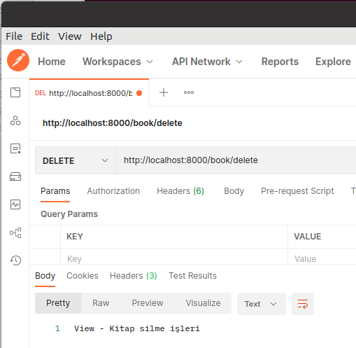
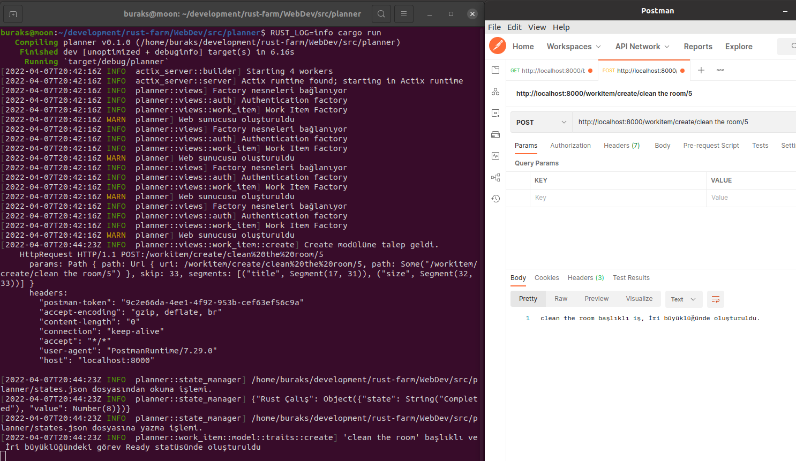
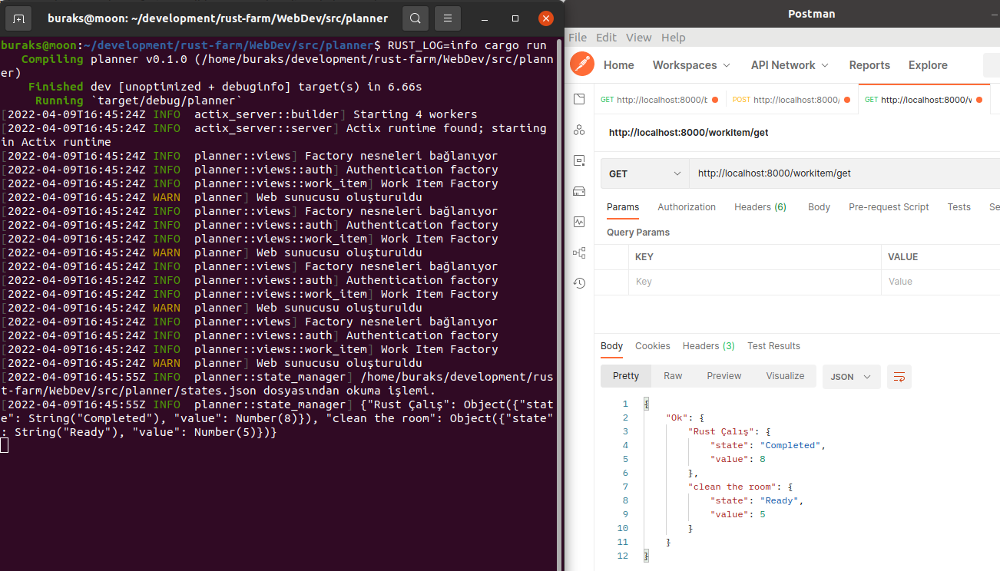
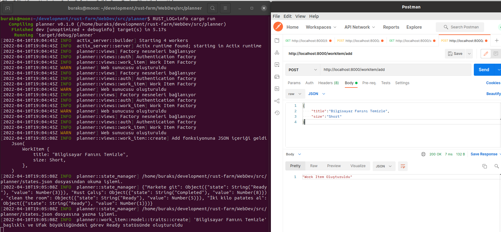
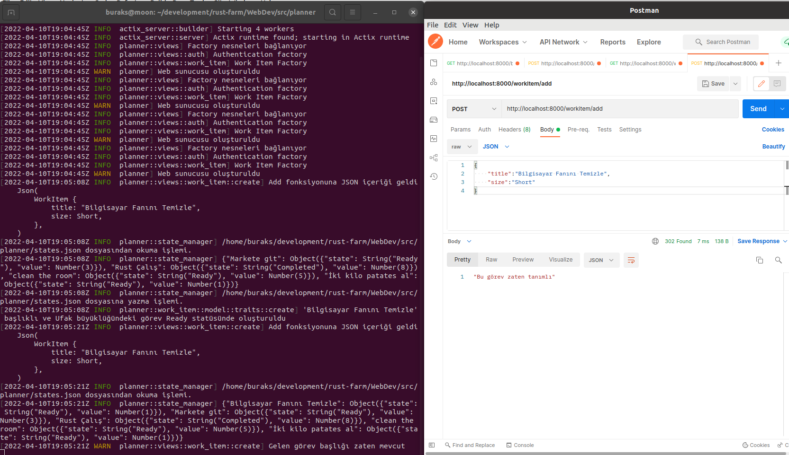
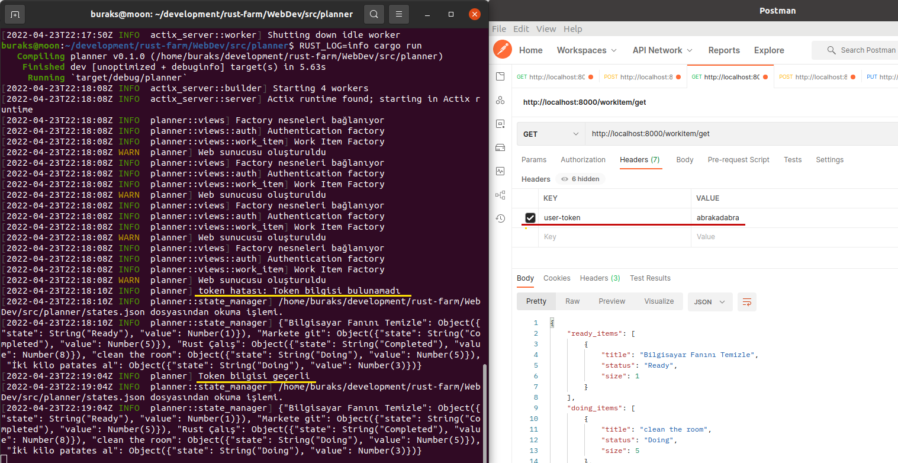

# Örnek Web Uygulaması

Rust, programlama dilleri piramidi düşünülünce C ve C++ ile aynı seviyede yer alan bir sistem programlama dili esasında. Ancak sunduğu bellek güvenliği garantili yüksek performans ve minimal kaynak tüketimi düşünülünce bir web uygulamasının ana motorunu yazmak için de tercih edilebilir. Rust ile web programlamanın nasıl yapıldığını öğrenmek için **Maxwell Flitton** tarafından yazılmış **Packt** yayınlarından **[Rust Web Programming](https://www.amazon.com/Rust-Web-Programming-hands-programming/dp/1800560818)** kitabını takip ediyorum. Burada yer alan planner isimli projeyi bu kitaptan öğrendiklerimle yazmaya çalışmaktayım.

Uygulama basit bir todo klonu. Kişisel planlamalarımıza dahil edeceğimiz isteklerimizi ready, doing, done gibi statülerle ele alıyoruz. Bu işi yürütecek bir web arabiriminin peşindeyiz. Kişisel bir kanban olarak düşünebiliriz.

- [x] Gün #1 - Projenin temel veri yapılarının oluşturulması.
- [x] Gün #2 - Actix Web Framework Hakkında ön bilgilerin kazanılması.
- [x] Gün #3 - Actix Web Framework tarafında View'ların kullanılması.
- [ ] Gün #4 - JSON ile çalışan Create ve Edit view'larının hazırlanması. 
- [ ] Gün #5 - 
- [ ] Gün #6 -
- [ ] Gün #7 -
- [ ] Gün #8 -

# Gün 1 Denemeleri - Projenin temel veri yapılarının oluşturulması.

```bash
# states.json'a Ready statüsünde yeni bir work item eklemek için
RUST_LOG=info cargo run set -a create -t "Rust Çalış" -v 8
# Var olan work item'ı çekmek için
RUST_LOG=info cargo run set -a get -t "Rust Çalış" -v 8
# Ready statüsünde olan bir work item'ı doing'e çekmek için
RUST_LOG=info cargo run set -a edit -t "Rust Çalış" -v 8
# ve Doing statüsünden Completed'a çekmek için tekrardan
RUST_LOG=info cargo run set -a edit -t "Rust Çalış" -v 8
# Var olan bir work item'ı silmek için
RUST_LOG=info cargo run set -a delete -t "Odayı Temizle" -v 8
```


# Gün 2 Denemeleri - Actix Web Framework Hakkında ön bilgilerin kazanılması.

```bash
# actix'in en basit kullanım şeklinin ele alındığı actix_hw
cargo run
```


# Gün 3 Denemeleri - Actix Web Framework tarafında View'ların kullanılması.

Actix tarafında view'ların yönetimini nasıl yapıldığına dair bir çalışma. actix_views isimli projenin klasör yapısı şöyle.

```bash
# src klasöründeyken
mkdir views
mkdir views/book
touch views/book/create.rs
touch views/book/get.rs
touch views/book/update.rs
touch views/book/delete.rs
touch views/book/mod.rs
touch views/mod.rs
touch views/path.rs
```




# Gün 4 Denemeleri - JSON ile çalışan Create ve Edit view'larının hazırlanması.

Öncelikle view'lar için bir klasör yapısı oluşturulmalı.

```bash
# terminalde src klasöründeyken
mkdir views
mkdir views/auth
touch views/mod.rs
touch views/path.rs
touch views/auth/login.rs
touch views/auth/logout.rs
touch views/auth/mod.rs

mkdir views/work_item
touch views/work_item/mod.rs
touch views/work_item/create.rs
```

İlk denemede HTTP Post kullanılarak bir Work Item oluşturulabildiği görüldü.



Work item listesini JSON formatında dönen get fonksiyonunun ilk versiyonuna ait çalışma zamanı görüntüsü. 



Geriye döndürülecek Work Item listesi için serileştirme işlemi özelleştirildikten sonraki durum.


HTTP Request JSON içeriği ile yeni bir work item eklenmesine ait çalışma zamanı görüntüleri.





HTTP Put operasyonunu ele adan edit modülüne ait edit fonksiyonunun kullanımına ait çalışma zamanı görüntüleri.
İlk önce var olan bir görevin büyüklüğünü değiştirmek üzere Put talebi gönderiliyor. Bu arada görevin durumu Ready.


Değişiklik talebi sonrası talebin işlendiğini ve durumun Ready'den bir sonraki durum olan Doing'e çekildiğini görebiliriz.


Token bilgisi ekleyip servisi denerken aldığımız sonuçlar. Token bilgisi kulladığımız ve kullanmadığımız hallerdeki çıktıyı gösteriyor.

